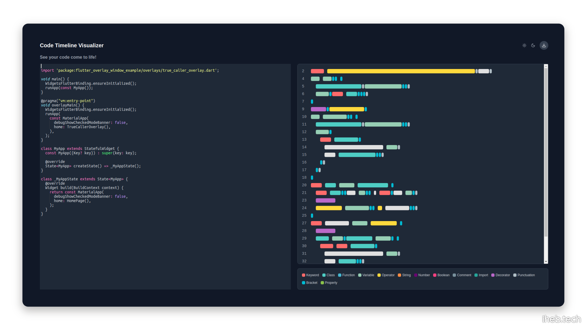

# Coding Visualizer

**An Interactive Code Timeline Generator**

Code Visualizer transforms source code into dynamic, visual timelines that make code structure easier to understand and analyze. This open-source tool helps developers and students explore code in a new, intuitive way.

## Features

- Generate interactive visualizations from code snippets
- Color-coded segments for improved readability
- Customizable highlighting and annotations
- Support for multiple programming languages
- Easy-to-use web interface

<!-- ## Try It Out

Experience Code Visualizer in action at: [URL coming soon]

## Getting Started

[Installation and usage instructions will go here] -->

<!-- ## Contributing

We welcome contributions! Please see our contributing guidelines for more details. -->

<!-- ## License -->

<!-- This project is open source and available under the [License type] license. -->